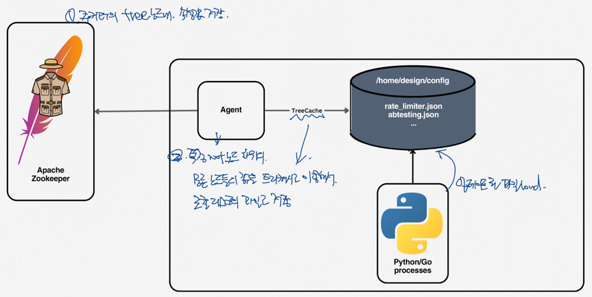

## 동적 구성
- 전체시스템을 다시 시작할 필요가 없이 시스템 튜닝이나 작동 방식을 변경 할 수 있다.
- example
  - Rate Limiter 의 처리 량 변경
  - 게이트웨이 설정값 변경 등

## 동적구성의 일반적인 요구사항
- 문자열로만 구성한다
- 설정값들은 10메가 바이트를 넘지 않는다
- 10초이내에 변경사항이 적용되어야 한다.
- 동적구성 관련해서 장애가 발생해도 전체시스템에 장애가 전파되면 안된다.

## key-value store (Simple Design)
- pull model 방식
- Netflix Archaius (github copilot 답변) :  동적 구성 관리를 위한 Java 라이브러리입니다. 클라우드 환경에서 애플리케이션의 설정을 실시간으로 관리하고 변경할 수 있게 해주는 도구로, Netflix에서 개발되었습니다. Archaius는 다양한 소스(환경 변수, 파일 시스템, URL, 데이터베이스 등)에서 구성 정보를 동적으로 로드하고, 변경 사항을 실시간으로 애플리케이션에 반영할 수 있습니다. 이를 통해 서비스 재시작 없이 애플리케이션의 동작을 조정하거나 튜닝할 수 있습니다.
    ### Netflix Archaius 사용 방법 예시:
    1. **의존성 추가**: Archaius를 사용하기 위해 먼저 프로젝트의 `build.gradle` 파일에 의존성을 추가합니다.
         ```groovy
         dependencies {
             implementation 'com.netflix.archaius:archaius-core:0.7.6'
         }
         ```
  2. **구성 관리**: Archaius를 사용하여 애플리케이션의 구성을 관리합니다. 예를 들어, 프로퍼티 파일에서 설정을 로드하고, 이를 애플리케이션에서 사용할 수 있습니다.
     ```java
     ConfigurationManager.loadCascadedPropertiesFromResources("application");
     String someProperty = DynamicPropertyFactory.getInstance().getStringProperty("some.property", "default").get();
     ```
  3. **동적 변경 감지**: Archaius는 구성 소스의 변경을 자동으로 감지하고, 이에 따라 애플리케이션 내의 설정 값을 동적으로 업데이트합니다. 개발자는 특별한 코드 변경 없이도 설정 변경 사항을 적용할 수 있습니다.
  4. Netflix Archaius는 특히 마이크로서비스 아키텍처에서 설정 관리의 복잡성을 줄이고, 서비스의 유연성과 확장성을 향상시키는 데 유용합니다. Netflix 자체의 클라우드 기반 서비스에서 널리 사용되며, 다양한 환경에서의 구성 관리를 위한 강력한 솔루션을 제공합니다.
- 문제점 : SPOF

## 옵저버패턴을 응용한 동적구성
- push model 방식
- Apache Zooker 를 사용하여 구현 가능하다.
  - 각 노드에 watch를 등록하면 그 노드의 상태가 변경되었을때 클라이언트로 통보가 간다.
  - watch는 존재하지 않는 노드에 대해서 등록할 수 없다. -> 부모노드에 watch 등록
  - 주키퍼가 down되면 클라이언트는 watch를 잃어버린다. -> 클라이언트 Local Cache 사용 (sidecar pattern)
    - sidecar pattern(github copilot 답변) : 사이드카 패턴은 마이크로서비스 아키텍처에서 사용되는 디자인 패턴 중 하나입니다. 이 패턴은 각 마이크로서비스의 주요 기능을 보조하는 보조 프로세스나 서비스를 함께 배치하는 방식을 말합니다. 사이드카는 마이크로서비스와 같은 컨테이너 내에 배치되며, 네트워크 통신, 보안, 모니터링과 같은 공통 기능을 처리하여 마이크로서비스가 비즈니스 로직에만 집중할 수 있도록 돕습니다.
    - 사이드카 패턴의 주요 특징:
      - 공통 기능의 분리: 로깅, 모니터링, 구성 관리와 같은 공통 기능을 마이크로서비스로부터 분리하여 사이드카가 담당합니다.
      - 서비스의 독립성 유지: 사이드카는 마이크로서비스와 동일한 생명주기를 공유하지만, 기능적으로는 독립적입니다. 이를 통해 서비스를 개발하고 배포하는 과정에서의 복잡성을 줄일 수 있습니다.
      - 언어 및 기술의 독립성: 사이드카는 마이크로서비스가 사용하는 프로그래밍 언어나 기술 스택에 구애받지 않고, 다양한 언어로 작성된 서비스에 적용할 수 있습니다.
      - 재사용성: 공통 기능을 사이드카로 구현함으로써, 다른 마이크로서비스에서도 동일한 사이드카를 재사용할 수 있습니다.

## System Design


## 관련 오픈소스
- Apache Curator - TreeCache
  - Python - Kazoo
- File Monitoring 
  - Python - watchdog
  - Go - fsnotify