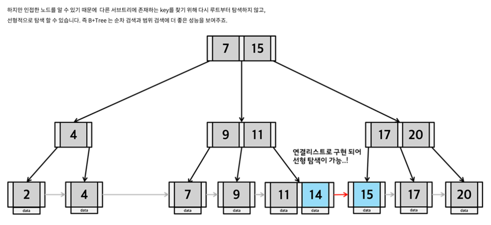
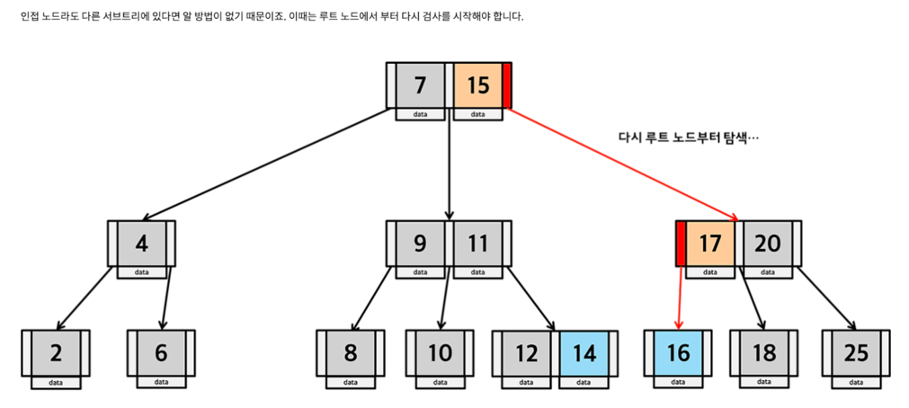

# Tree 
- 트리(Tree) 자료구조는 계층적 구조를 표현하는 데 사용
- 각 노드가 자식 노드를 가질 수 있는 구조
- 주요 트리 구조
  - 이진 탐색 트리(BST)
  - B-Tree
  - B+Tree

## BST (BINARY SEARCH TREE)
- [CODE](../../study.source/src/main/kotlin/cs/data_structure/BinarySearchTree.java)
- 트리는 부모와 자식 관계를 통해 노드들이 연결된 계층적 자료구조
- 각 노드에 최대 두 개의 자식 노드를 가짐
- 트리의 가장 상위에 위치한 노드를 루트(root), 가장 하위에 있는 노드를 잎(leaf) 혹은 종단 노드
- 모든 트리는 여러 개의 서브트리(subtree)로 구성
- 왼쪽 서브트리의 값은 루트보다 작고, 오른쪽 서브트리의 값은 루트보다 크다
- 이진 탐색 트리는 정렬된 데이터를 빠르게 검색, 삽입, 삭제할 수 있는 자료구조로, 다음과 같은 경우에 사용
  - 데이터 검색: 키 기반 검색이 필요한 경우 효율적으로 데이터를 찾을 수 있음.
    - DB의 인덱스 구조
    - 파일 시스템에서 디렉토리 검색
    - 사전(Dictionary) 자료구조 구현
  - 정렬 데이터 관리: 동적으로 변화하는 데이터(삽입/삭제)에 대해 정렬 상태를 유지해야 하는 경우에 유용
    - 동적 데이터 저장소
    - 순위 관리 시스템
  - 범위 쿼리 (Range Query): 특정 범위 내의 데이터를 빠르게 탐색하고 추출할 수 있음
  - 이진 기반 알고리즘 구조
- 사용하는 이유
  - 효율적인 시간복잡도
    - 검색, 삽입, 삭제 = O(h) &rarr; h는 트리의 높이
    - 큰 데이터를 처리해야 하는 경우 리스트나 배열보다 더 효율적
  - 데이터 정렬 유지
  - 동적 관리 : 크기가 고정되지 않고 변화하는 데이터를 처리하기에 적합
  - 다양한 변형 트리와 확장성
- 문제점
  - 트리가 편향(Skewed)되면 최악의 경우 시간복잡도는 O(n)까지 증가 &rarr; AVL 트리, 레드-블랙 트리 등 균형 탐색 트리를 사용하여 균형을 유지

## B-Tree (Balanced Tree)
- B-Tree는 이진 트리와 다르게 각 노드가 둘 이상의 자식을 가질 수 있는 비선형적인 자료구조 &rarr; 각 노드가 여러 자식 노드, 여러개의 키를 가진다.
  - B-Tree가 차수가 커질수록 더 많은 데이터를 단일 노드에서 관리하게 되므로 복잡한 검색, 삽입, 삭제 작업을 동일한 복잡성으로 유지
- 검색, 삽입, 삭제 작업이 O(log n)의 시간복잡도를 가진다.
  - B-트리는 삽입이나 삭제 과정에서 트리의 균형 유지 &rarr; 모든 자식 노드들은 루트로부터 동일한 높이를 유지하게 되며, 탐색, 삽입, 삭제 연산이 항상 일정한 시간복잡도
- 모든 리프 노드가 같은 깊이를 가짐
  - **팬아웃(분기 정도)을 조절:** B-트리의 주요 파라미터는 노드의 '차수' 또는 '팬아웃'(`m`). 
  - 팬아웃은 노드가 가질 수 있는 최대 자식 노드 수를 결정 &rarr; 트리의 높이와 탐색 경로를 조절할 수 있음.
- (단점) B-Tree의 직접적인 구현은 복잡하며, 자바 표준 라이브러리에는 TreeMap 등이 이와 비슷한 방식으로 동작
  - B-Tree는 효율성을 위해 노드내에서 여러 키를 저장하지만, 이는 추가적인 오버헤드가 발생된다. 노드는 모든 키와 포인터를 저장해야 하며, 대부분의 노드는 전체공간의 일부만 사용한다.

## B+Tree (B-Tree 확장형)
- B+Tree는 B-Tree와 달리 리프 노드에만 모든 데이터를 저장하며, 내부 노드는 키와 포인터만 포함하여 더 많은 키를 관리할 수 있음
- 범위 쿼리 성능이 뛰어난 이유는, 리프 노드가 순서대로 연결되어 있기 때문에 시작점부터 범위의 끝까지 순차적으로 탐색하기 떄문
  - 따라서 B+트리는 범위 쿼리를 수행하는데 있어 매우 유용
- 내부 노드는 키와 포인터만 저장.
- 리프 노드는 데이터 값을 포함하며, 리프 노드들이 링크드 리스트 형태로 연결됨.

## 참고자료
[[DB] 인덱스에서 B+Tree를 사용하는 이유](https://munak.tistory.com/182)
  - B+Tree의 리프 노드끼리 연결되어 있어서 범위 검색(range queries)의 효율성이 뛰어나므로, 이왕이면 B+Tree가 더 효율적인 인덱싱 구조
  - B+Tree 탐색
    - 시간복잡도 : O(logN)
    
  - B-Tree 탐색
    - 시간복잡도 : O(logN)
    
