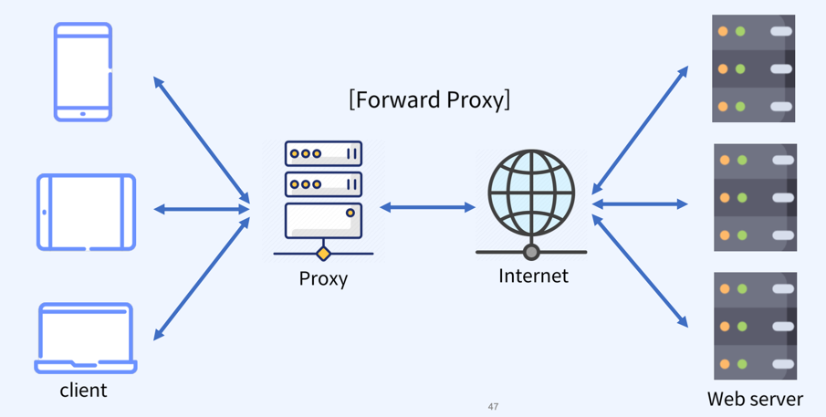
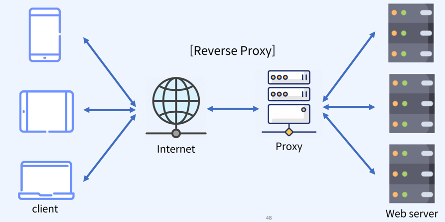

### Http Header
- Key, Value 형태
- http요청시에 요청 URL, RequestBody에 전송되는 값이 아닌 요청규약, 인증정보등을 가진 데이터
### Proxy
- No Config Proxy?
  - Proxy구성이 없으면 사용자의 요청은 직접 웹서버에 전달되어 서버 부담을 가중하게 된다.
  - 단일 웹서버 구성은 장애 발생시 서비스 가용성에 치명적이다.
  - 다중 웹서버 구성으로 여러 사용자의 요청을 처리할 경우에도 요청한 부하를 적절히 분산시켜 주지 못하면 한 서버에 부하가 몰리는 Hotspot이 발생하는 등의 문제가 발생할 수 있다.
  - 최종 사용자의 관점에서 응답시간 만족도를 충족시킬수 없을 수도 있다.
- Proxy
  - 요청자와 응답자간의 중계역할. 즉, 통신을 대리 수행하는 서버를 Proxy Server라고 함.
  - 위치에 따라 forward proxy, reverse proxy로 구분(reverse proxy가 일반적으로 더 많이 이용됨)
  - forward proxy: client와 internet사이에 있어서 client의 정보가 서버에 노출되지 않음
    - 캐싱서버 구현
    - 특정 사이트 접근 차단 구현
    
  - reverse proxy: client의 요청을 서버 대신 받아서 전달. client에게 서버 노출 안됨
    - Load Balancing 구현
    - 캐싱서버 구현
    - 무중단 배포
    - SSL암호화 적용
    
- Ngnix
  - 기본구성 값으로 웹서버를 실행하나 추가구성으로 Reverse Proxy 구성이 가능하다.
  - `kubernetes`의 `ingress controller`로 `nginx ingress controller`선택이 가능
  - API Gateway 구성 가능
  - (리눅스기준) /etc/nginx 하위의 nginx.conf 변경을 통해 구성 가능
  - Nginx Reverse Proxy
    - 클라이언트의 요청이 80포트로 들어오면 애플리케이션 서버의 주소로 트래픽을 분배
    - 기본 분배방식(Load Balancing): Round-Robin
    - IP당 서버를 분배하는 ip_hash등 여러가지 부하분산 알고리즘을 사용할 수 있음
    - https://docs.nginx.com/nginx/admin-guide/load-balancer/http-load-balancer/
  - [nginx.conf 예제](nginx.conf)
- HAproxy
  - 하드웨어 기반의 L4/L7 스위치를 대체하기 위한 오픈소스 SW 솔루션
  - TCP및 HTTP기반 애플리케이션을 위한 고가용성 LoadBalacing 및 프록시 기능을 제공하는 매우 빠르고 안정적인 무료 Reverse Proxy
  - 주요기능
    - 통계정보 활용가능
    - SSL 지원
    - Load Balancing
    - Active Health Check
    - KeepAlived(proxy 이중화)
  - HAproxy, L4
    - IP를 이용한 트래픽 전달
    - IP와 Port를 기반으로 사용자 요청 트래픽을 전달하도록 구성
    - 요청에 대한 처리는 round-robin방식으로 부하 분산
  - HAproxy, L7
    - Http기반의 URI를 이용한 트래픽 전달
    - 동일한 도메인의 하위에 존재하는 여러 웹 애플리케이션 서버를 사용할 수 있다.
    - 사용자의 요청과 설정에 따른 부하분산
    - [L7기반의 URI매핑 HAproxy.cfg 예제](haproxy.cfg)
